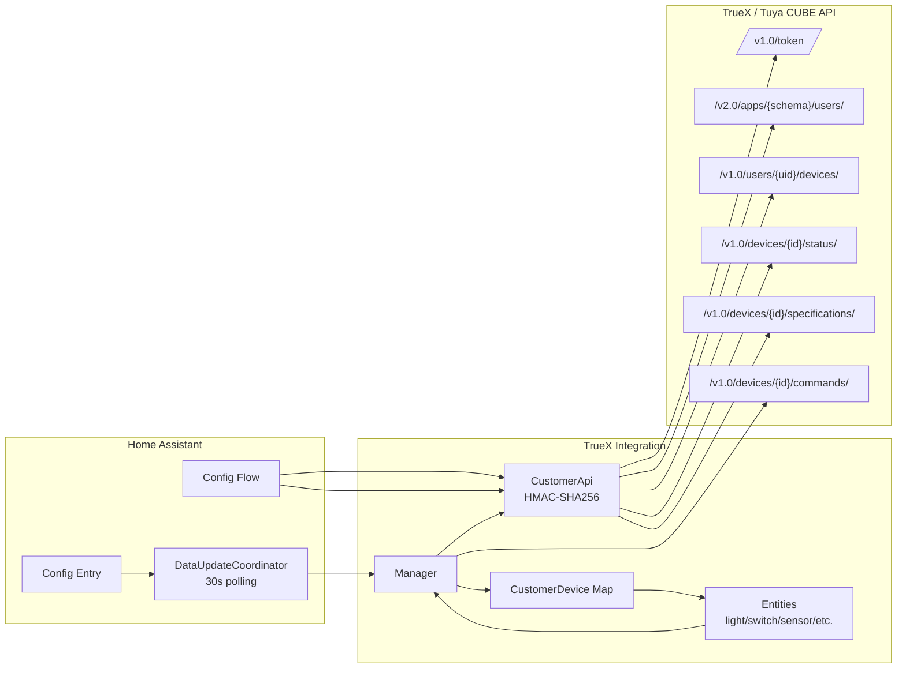

# TrueX Smart Home (Home Assistant Custom Integration)

การเชื่อมต่อ Home Assistant กับ TrueX / Tuya CUBE API (grant_type=1) เพื่ออ่านสถานะและควบคุมอุปกรณ์ผ่านการ polling

## Features
- ตั้งค่าผ่าน Config Flow (UI) ด้วย API URL, Client ID, Client Secret, Schema, Username
- รองรับแพลตฟอร์ม `binary_sensor`, `climate`, `cover`, `light`, `sensor`, `switch`
- เซ็นคำขอด้วย HMAC-SHA256 ตาม Tuya OPENAPI CUBE
- โหมดการทำงานแบบ `cloud_polling` ทุก 30 วินาที

## Installation
1. คัดลอกโฟลเดอร์ `custom_components/truex` ไปไว้ในโฟลเดอร์ `custom_components` ของ Home Assistant
2. รีสตาร์ท Home Assistant
3. ไปที่ Settings → Devices & Services → Add Integration → เลือก “TrueX Smart Home”
4. กรอกค่า API URL, Client ID, Client Secret, Schema, Username

## Configuration Fields
- **API URL**: Endpoint ของ TrueX/Tuya CUBE (เช่น `https://openapi.tuyaus.com`)
- **Client ID / Client Secret**: คีย์สำหรับแอป CUBE
- **Schema**: แอป schema สำหรับ endpoint `/v2.0/apps/{schema}/users`
- **Username**: ชื่อผู้ใช้เพื่อ lookup UID ในระบบ

## Supported Platforms
- **Switch**: หมวด `kg`, `cz`, `pc`, `dlq` ใช้ `switch_1..switch_8` และ `switch`
- **Light**: หมวด `dj`, `xdd`, `fwd`, `dc`, `dd`, `tgkg`, `tgq`, `fsd`
- **Climate**: หมวด `kt`, `wk`, `ktkzq` (ต้องมี `switch`)
- **Cover**: หมวด `cl`, `clkg`, `ckmkzq`, `mc` (ใช้ `control`, `percent_control`, `position`)
- **Sensor (wsdcg)**: `va_temperature`, `va_humidity`
- **Sensor (zndb)**: `cur_power`, `cur_voltage`, `cur_current`, `add_ele`
- **Sensor (co2bj)**: `co2_value`
- **Sensor (hjjcy)**: `pm25_value`, `co2_value`, `voc_value`, `ch2o_value`, `va_temperature`, `va_humidity`
- **Sensor (generic)**: `battery_percentage` (ถ้ามี)
- **Binary Sensor (mcs)**: `doorcontact_state`
- **Binary Sensor (pir)**: `pir`
- **Binary Sensor (sj)**: `watersensor_state`
- **Binary Sensor (ywbj)**: `smoke_sensor_status`, `smoke_sensor_state`
- **Binary Sensor (rqbj)**: `gas_sensor_status`, `gas_sensor_state`
- **Binary Sensor (cobj)**: `co_status`, `co_state`

## How It Works
1. Config Flow เรียก `CustomerApi.get_access_token()` และ `get_user_by_username()` เพื่อหา UID
2. `custom_components/truex/__init__.py` สร้าง `Manager` แล้วดึง device list + specifications
3. `DataUpdateCoordinator` ทำ polling สถานะทุก 30 วินาที
4. แต่ละ Entity ส่งคำสั่งผ่าน `Manager.send_commands()` และขอ refresh หลังสั่งงาน

## Structure (Mermaid)

## Dev Notes
- ใช้งาน SDK ที่พอร์ตไว้ใน `custom_components/truex/truex_sharing/*`
- ไฟล์ `custom_components/truex/truex_api.py` และ `custom_components/truex/device.py` ยังไม่ได้ถูกใช้โดย integration ในปัจจุบัน
- ไฟล์ Postman สำหรับทดสอบอยู่ที่ `Tuya Cloud APIs.postman_collection.json` และ `Tuya Cube.postman_environment.json`
